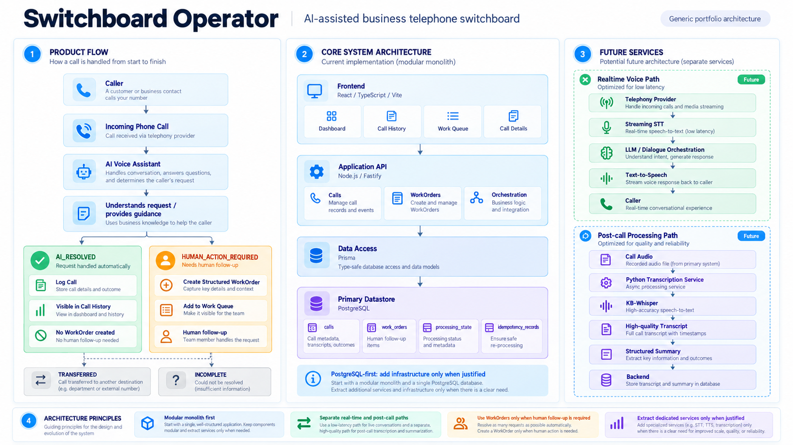

# Switchboard Operator

Switchboard Operator is a conceptual AI-assisted business phone switchboard: it aims to handle incoming calls, resolve suitable requests during the conversation, and create structured WorkOrders only when human follow-up is needed. This independent engineering portfolio project is not associated with any employer or company. It explores product thinking, system design, frontend/backend integration, and pragmatic architecture. All demo data must be fictional.

## Target Architecture 

The diagram below shows the intended architecture and how the system can evolve beyond the current MVP.
Its WorkOrders, orchestration, and voice paths are not implemented yet.



## Current state (Milestone 2)

The application persists fictional Calls in PostgreSQL, reads them through Prisma and `GET /calls`, and displays them in Call History. The frontend validates the API response using a shared Zod contract. An outcome can be pending (`null`), while `INCOMPLETE` is an explicitly unresolved outcome. **There are no WorkOrders, AI assistant, real calls, transcripts, or telephony integrations yet.** The `/health` endpoint checks API liveness, not database readiness.

## Local development

Requires Node.js 26 (or a compatible recent Node.js version), pnpm 11, Docker, and Docker Compose. Run from the repository root:

```bash
pnpm install
cp apps/api/.env.example apps/api/.env
docker compose up -d db
pnpm db:validate
pnpm db:migrate
pnpm db:generate
pnpm db:seed
pnpm dev
```

Open http://127.0.0.1:5173. The API exposes `GET /health` and `GET /calls` at http://127.0.0.1:3001; the Vite development server forwards `/api/*` requests to it. PostgreSQL is available on `127.0.0.1:5433` with **demo-only** credentials in `docker-compose.yml`. The migration creates the Call table; `db:generate` creates the local Prisma client. `db:seed` adds five fictional Calls with fixed IDs and skips existing seeds on repeat runs. Stop the local DB with `docker compose down` (data remains in the named volume).

Checks:

```bash
pnpm typecheck
pnpm test
pnpm build
```

The API build can be started separately with `pnpm --filter @switchboard/api start` after `pnpm build`. Configuration examples are in `apps/api/.env.example`; real `.env` files are ignored by Git.

## Stack and architecture

- `apps/web`: React, Vite, Tailwind CSS, shadcn/ui primitives, CSS Modules for page-specific styling, React Testing Library.
- `apps/api`: Fastify, TypeScript, Vitest, a read-only Calls API, and Prisma with the PostgreSQL driver adapter.
- `packages/shared`: Zod contracts for health and Call History responses.
- `docker-compose.yml`: local PostgreSQL. See [architecture and planned workflow](docs/architecture.md).

Fictional seed data includes `AI_RESOLVED`, `HUMAN_ACTION_REQUIRED`, `TRANSFERRED`, `INCOMPLETE`, and a Call without an outcome. These are stored demonstration records, **not the result of an implemented AI workflow**. The intended MVP will eventually confirm an AI-resolved call without a WorkOrder and create a WorkOrder only for a call requiring human action. Real telephony and AI integrations may be mocked during early development; the architecture is designed to evolve incrementally.

## Limitations and next steps

Call History is read-only and currently returns all Calls without pagination or filters; `GET /calls/:id` waits for a real Call Details view. Later milestones add conditional WorkOrder creation, a Work Queue, simulated AI output, and human review. A production service would require authentication, authorization, auditability, retention policies, secured storage, privacy and regulatory assessment where applicable, reliable asynchronous processing, and deployment hardening. Do not use real caller information in this prototype.
